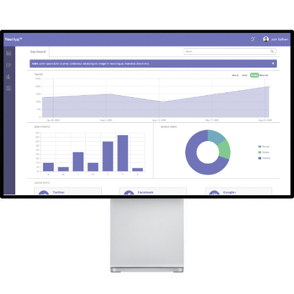

# WebApp Dashboard

The following project was created to train skills in **JavaScript**, **SASS**, and **HTML**.

## Purpose 

An interactive dashboard for web application using advanced web techniques and JavaScript programming. The dashboard contains adjustable graphs, charts, and other user interface components. It uses features like **local storage** and an **autocomplete** feature to maximize the user experience. Built with a mobile-first approach, it uses CSS Grid and Flexbox to achieve maximum flexibility.

## Skills

* JavaScript
* jQuery
* SVG Graphics
* SASS
* CSS Grid
* CSS Transitions & Animations
* CSS Flexbox
* Media Queries
* HTML